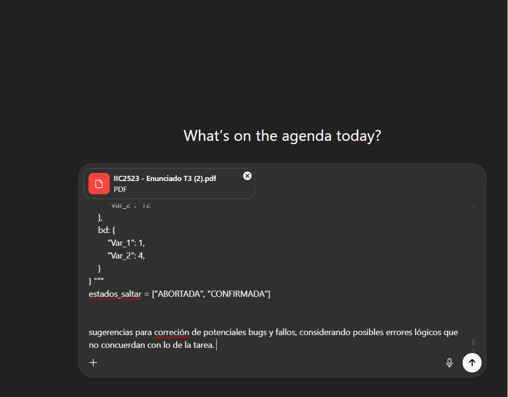
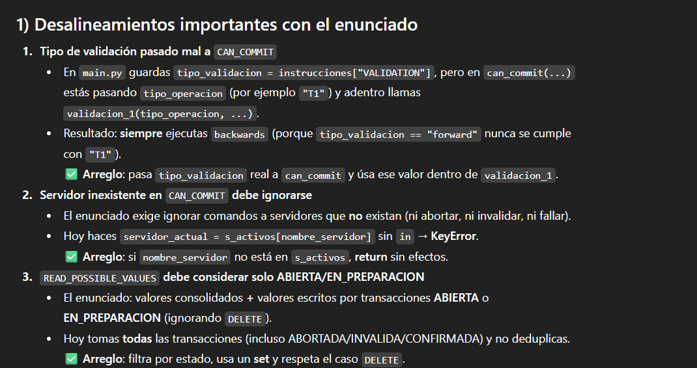
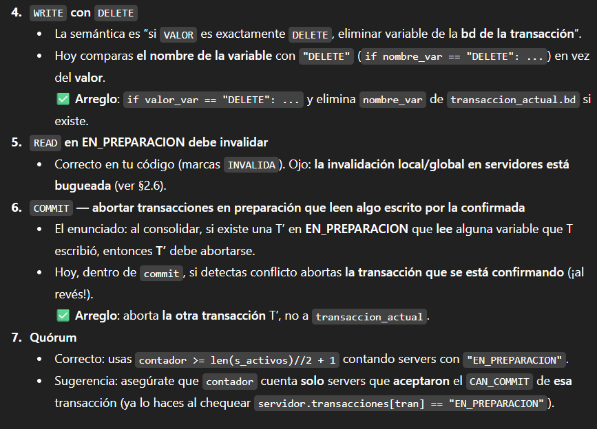

# Tarea 3 - Sistemas Distribuidos.

Integrantes:
 - Cristóbal Ignacio Albornoz Luengo.
 - Randall Fabrizio Biermann Olivari.
 - Fecha de Entrega: 26-10-2025

## Generalidades sobre el proceso de ejecución de tests

## 1. Ejecutar python3 main.py tests_publicos/backward/test_b_0X.jsonc
Al ejecutar los tests de backward, se tiene que todos devuelven el output esperado, por lo que cumplen con lo solicitado.

## 2. Ejecutar python3 main.py tests_publicos/forward/test_f_0X.jsonc
Al ejecutar los tests de forward, se tiene que todos devuelven el output esperado, por lo que cumplen con lo solicitado.

## 3. Con respecto al uso de herramientas generativas de código
Se ha hecho uso de herramienta de generación de texto para usos muy específicos:
Se utilizó ChatGPT para realizar depuración y testeo de errores. Sin embargo, todo el código
fue escrito por humanos, por lo que el uso que se le ha dado ha sido bien específico y concreto para poder
corregir errores, la interpretación de los mismos y aclaramiento de dudas, en complemento con la información
que se encuentra disponible en GitHub discussions.

## Capturas de pantalla del uso de modelos de lenguaje.

